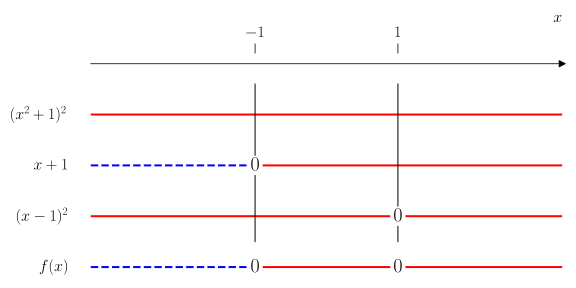

# `signchart`
`signchart` is a Python package for plotting sign charts for polynomial functions. It is designed to be simple to use to generate beatiful sign charts for polynomial functions.

## Basic example

```python
import signchart

f = "(x**2 + 1)**2 * (x - 1)**2 * (x + 1)"

signchart.make_sign_chart(f=f, include_factors=True)
signchart.savefig(
    dirname="dirname",
    fname="fname",
)

signchart.show()
```

This will generate the following sign chart:



---

## More examples

### Example 1

```python
import signchart

g = "x**2 - x - 6"

signchart.make_sign_chart(
    f=g,
    include_factors=True,
    color=True,  # Includes colored lines.
    fn_name="g(x)",  # Names the function g(x)
)

signchart.savefig(
    dirname="figures",
    fname="example_2.svg",
)

signchart.show()
```

This will generate the following sign chart:


### Example 2

```python
import signchart

g = "-2 * x**2 + 2 * x + 12"

signchart.make_sign_chart(
    f=g,
    include_factors=True,
    color=True,  # Includes colored lines.
    fn_name="g(x)",  # Names the function g(x)
)

signchart.savefig(
    dirname="figures",
    fname="example_3.svg",
)

signchart.show()
```

This will generate the following sign chart:


